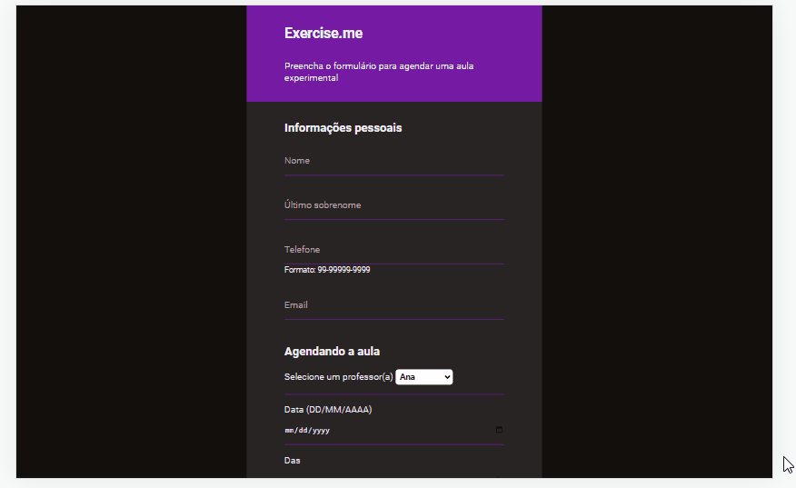

# O projeto:

  

  

# Form-Validation  
Projeto desenvolvido para prática de validação de formulário, funcionando como uma página para se inscrever em uma aula experimental de uma academia. Funcionalidades: ° Responsividade (mobile first); ° Verificação se o preenchimento dos campos do formulário foram feitos de forma correta.

## Comites "padronizados" conforme convenção de comites:  
feat: para uma nova funcionalidade adicionada. 
style: para estilização de um componente. 
fix: para a resolução de um bug.

## More Examples:  
feat: (Nova funcionalidade). 
fix: (Resolução de um bug). 
docs: (Alteração na documentação). 
style: (Estilização dos componentes/páginas). 
refactor: (Refatoração de código). 
test: (Testes criados para os códigos). 
chore: (Atualização de tarefas e bibliotecas). 

### Mais Referências:  
https://www.conventionalcommits.org/

## Como começar:  
Faça um clone do repositório. Execute a rota em seu servidor, url: http://127.0.0.1:5500/index.html, utilizei o Live Server (extensão do Visual Studio Code).

## Tecnologias utilizadas: 
JavaScript: ° Responsável por verificar se os campos do formulário foram preenchidos de forma correta, com mensagens customizadas para que o usuário possa colocar a informação necessária.

## GitHub Pages: 
Site publicado em:
